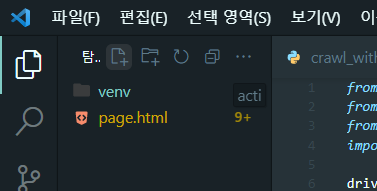
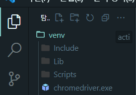
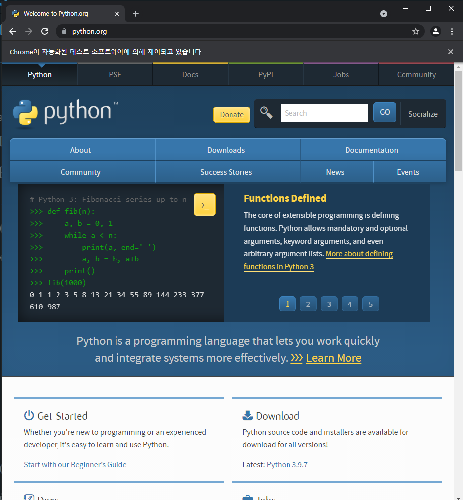
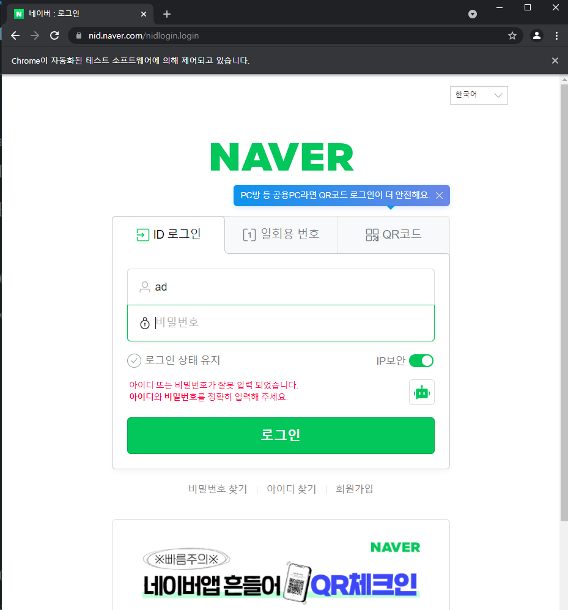

# Intro
교수님이 정정기간부터 과제를 내주셨다.  
이것도 못하면 그냥 __수강철회__ 하라고 하셨다.  
그럴수있나,,ㅋㅋㅋㅋ  
과제는 #웹크롤링 이였다.

# 웹 크롤링 환경설정하기
나는 이게 처음이라서 환경설정이 너무 오래걸렸따.  
기본적으로 아래 과정을 거친다.  
1. 가상환경 설정
2. selenium 다운

## 가상환경 설정하기
* 자신이 원하는 폴더에 vscode를 연다  
이후 아래 명령어를 이용하여 가상환경폴더를 생성한다.
```sh
$ python -m venv [가상환경폴더이름]
```
(원래는 [가상환경폴더이름]에 위치로 폴더를 생성할수있다.)  
```sh
$ python -m venv venv
```
실행시 나타나는 위치이다.
 

## chromedrive 설치하기
[여기](https://sites.google.com/chromium.org/driver/) 들어가서 stable release 버젼을 다운받는다.

그럼 압축파일이 다운받아지고,  
**chromedrive.exe** 가 생긴다.  
이거는 venv아래에 둔다.
 

# 기본적인 크롤링을 위한 예제 다운 및 모듈다운
기본적인 크롤링을 위해서 예제코드를 불러온다.
[예제코드](https://selenium-python.readthedocs.io/getting-started.html)  
들어가보면 
```py
from selenium import webdriver
from selenium.webdriver.common.keys import Keys

driver = webdriver.Chrome()
driver.get("http://www.python.org")
# assert "Python" in driver.title
# elem = driver.find_element_by_name("q")
# elem.clear()
# elem.send_keys("pycon")
# elem.send_keys(Keys.RETURN)
# assert "No results found." not in driver.page_source
# driver.close()
```
일단은 구동되는지만 확인하기 위해서 주석처리 및 나는 크롬을 쓰기때문에 firefox를 chorme으로 변경

## selenium 모듈 다운하기
```sh
$ pip install selenium
```

##  'chromedriver' executable needs to be in PATH 에러
이걸로 시간 개많이 썻는데,, 절대경로로 설정을 해야한다.
```py
driver = webdriver.Chrome(executable_path=r'C:\본인경로\venv\chromedriver.exe')
```
💥계속 안되면 , [여기](https://emessell.tistory.com/148)를 참고하여 경로설정을 바꿔보길 권한다


# 구동해보기 
내 과제는 네이버 자동 로그인 만들기 였다.  
일단은 위에 코드가 성공적으로 구현된다면 크롬창으로 페이지가 나올것이다.

 

# 과제하기
1. 네이버 로그인창을 __driver__ 를 통해 불러온다
2. 해당 로그인창의 html 소스를 확인한다.
3. 내가 원하는 버튼창의 이름을 찾는다.
4. 버튼창에 send_keys를 사용하여 아이디와 비밀번호를 넣는다.
5. 동일한 방법으로 로그인 비밀번호를 넣은후 click()모듈을 이용하여 클릭한다

* 아래는 필요한 소스입니당

```py
from selenium import webdriver
from selenium.webdriver.common import keys
from selenium.webdriver.common.keys import Keys

driver = webdriver.Chrome(executable_path=r'C:\Programming\database\assignment0\venv\chromedriver.exe')
driver.get("https://nid.naver.com/nidlogin.login?mode=form&url=https%3A%2F%2Fwww.naver.com")
id = driver.find_element_by_name("id")
id.send_keys("ad")
password = driver.find_element_by_name("pw")
password.send_keys("ad")
enter = driver.find_element_by_class_name("btn_login")
enter.click()
```
실행시에는 와 같은 창이 나오게 된다.
 

# 후기
코드짜는건 5분도 안걸린거같다. 근데 환경구축할때 저놈에 path설정에서 많이 헤맸다.. ㅠ 역시 뭐든 환경구축이 제일 어렵다

# vscode 가상환경 설정 
>__select interprinter__ 설정을 잊지마세요!  

ctrl+shift+p -> python interprinter-> venv 가상환경 선택  
 


